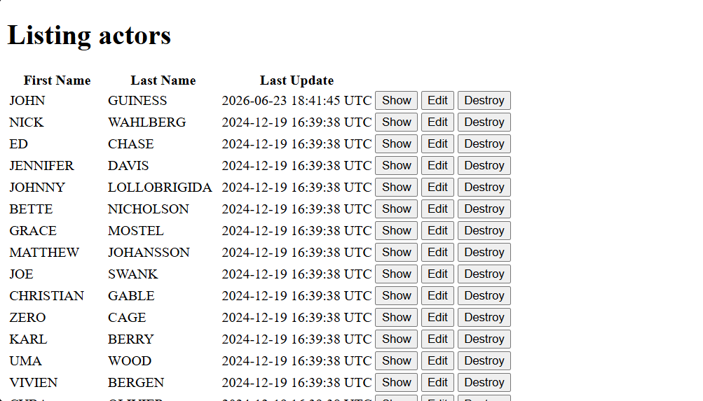

## Application Preview

  

## Demo Video

Watch the application in action:
(https://youtu.be/9Z9_yP9rGTg)

## Features

- Actor management interface
- Actor listing and detail views
- Forms for creating and updating actor records
- Predefined SQL query execution
- Dynamic table rendering for query results

